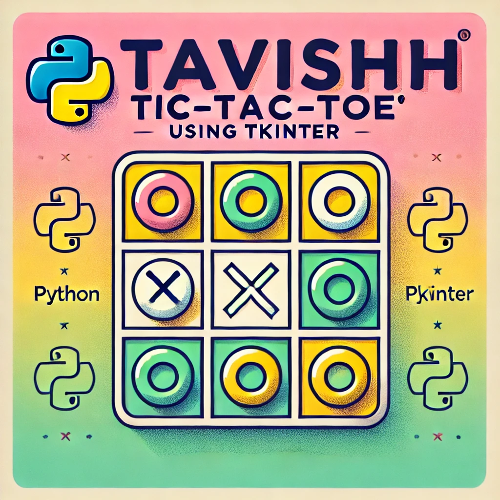
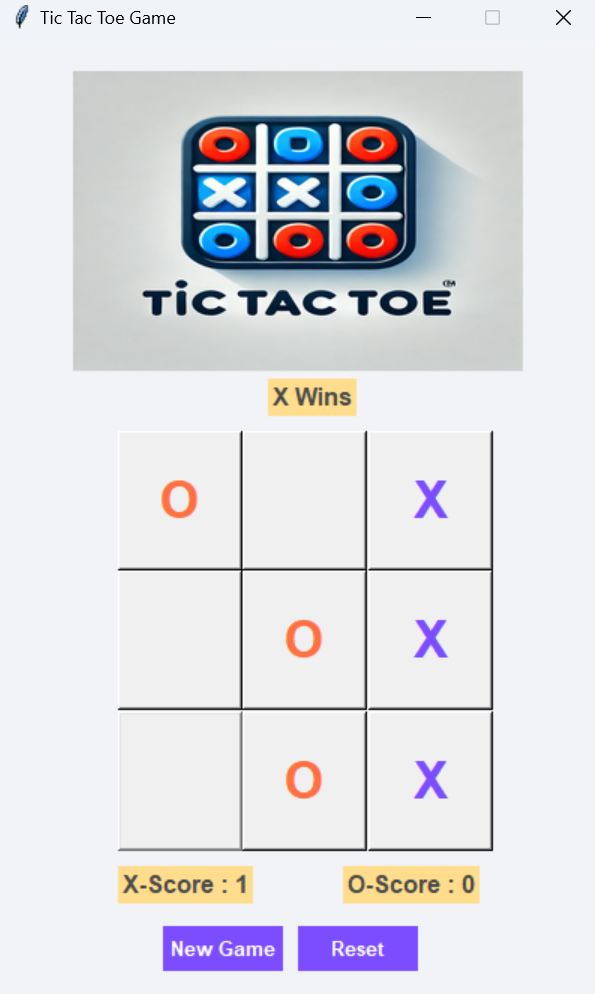
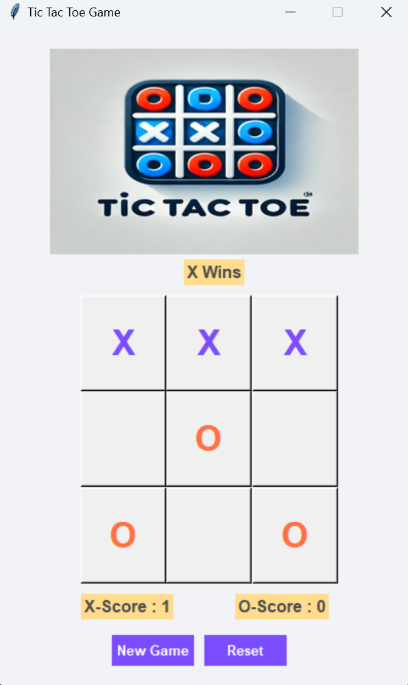
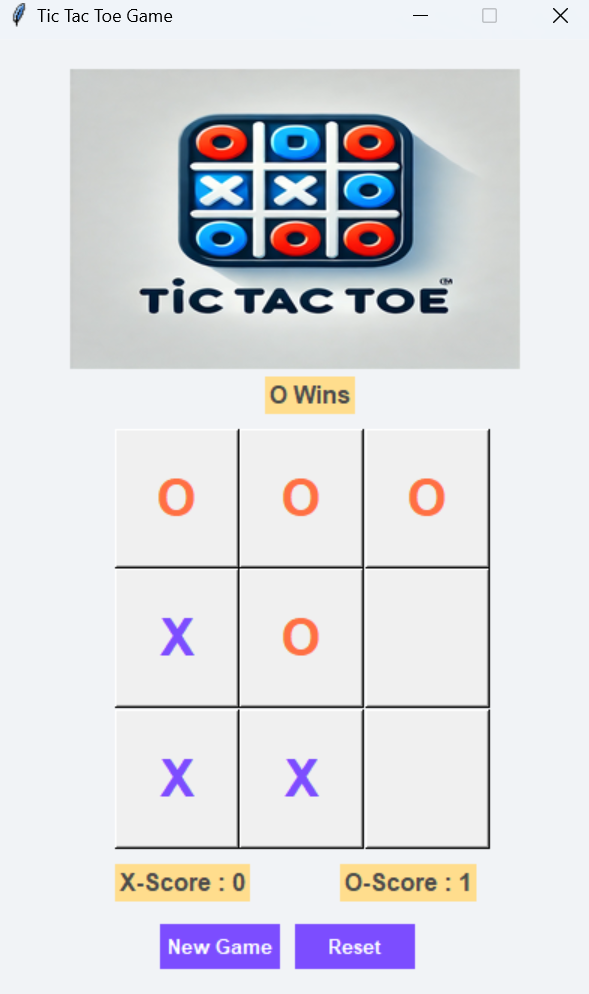

# **Tic Tac Toe Using Tkinter 💻🐍**


## **Overview**
**Tic Tac Toe Using Tkinter** is a modern implementation of the timeless classic game, designed and developed entirely by me. This project leverages Python's Tkinter library to create an engaging and interactive graphical interface while showcasing efficient game logic.

---

## **Features**
- 🟥 **Interactive GUI:** A visually appealing and responsive interface built with Tkinter.  
- 🟧 **Two-Player Mode:** Play with a friend in this competitive multiplayer game.  
- 🟨 **Game Logic Implementation:** Automatically detects winners and handles draws with efficient algorithms.  
- 🟫 **Reset and Replay Options:** Restart the game or replay the current session seamlessly.  
- 🟩 **Clean Codebase:** Developed with a focus on readability and maintainability.  
- ⬜ **Cross-Platform Compatibility:** Runs smoothly on any system with Python installed.  

---

## **How to Run 🎮**
1. **Prerequisites:** Ensure Python is installed on your system.  
2. **Clone the Repository:**  
   ```bash
   git clone https://github.com/tchawla827/tic-tac-toe.git
   ```
3. **Install Dependencies:**  
   ```bash
   pip install tkinter 
   pip install Pillow
   ```
4. **Launch the Application:**  
   ```bash
   python main.py
   ```

---

## **Technologies Used**
- **Python:** The core programming language used for functionality.  
- **Tkinter:** Used for designing the graphical user interface.  
- **Pillow:** Utilized for image handling and visual elements.  

---

## **Screenshots**
<table>
  <tr>
    <td></td>
    <td></td>
    <td></td>
  </tr>
</table>

---

## **Why I Built This**
I created this project to learn and explore GUI programming with Python. It allowed me to practice:
- Designing intuitive user interfaces.
- Implementing efficient algorithms for game logic.
- Managing user interaction and game states effectively.

This project is a stepping stone in my development journey, reflecting my skills and creativity.

---

## **About Me**
Hi, I’m **Tavish**, a student at **IIIT Allahabad** with a keen interest in software development and creating intuitive applications. This project showcases my ability to design, develop, and deliver complete solutions.  

---
